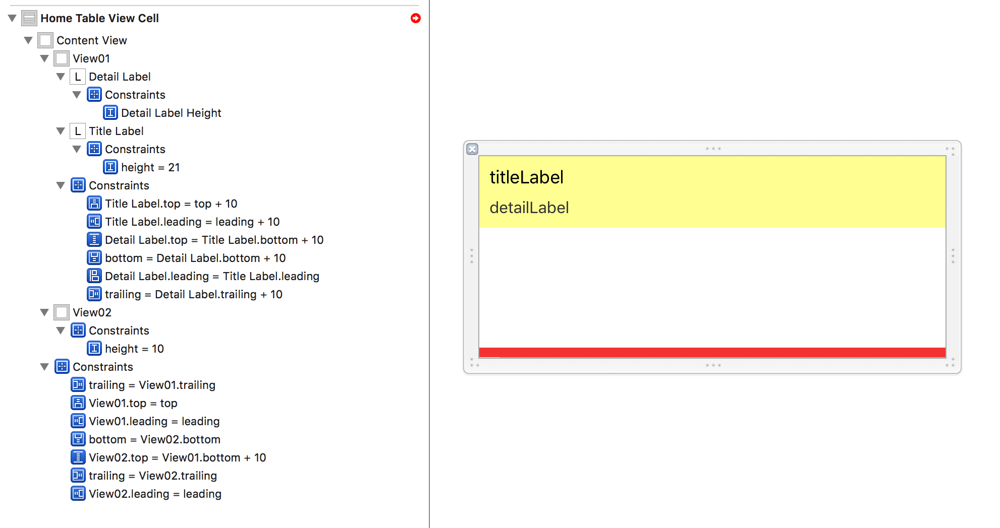
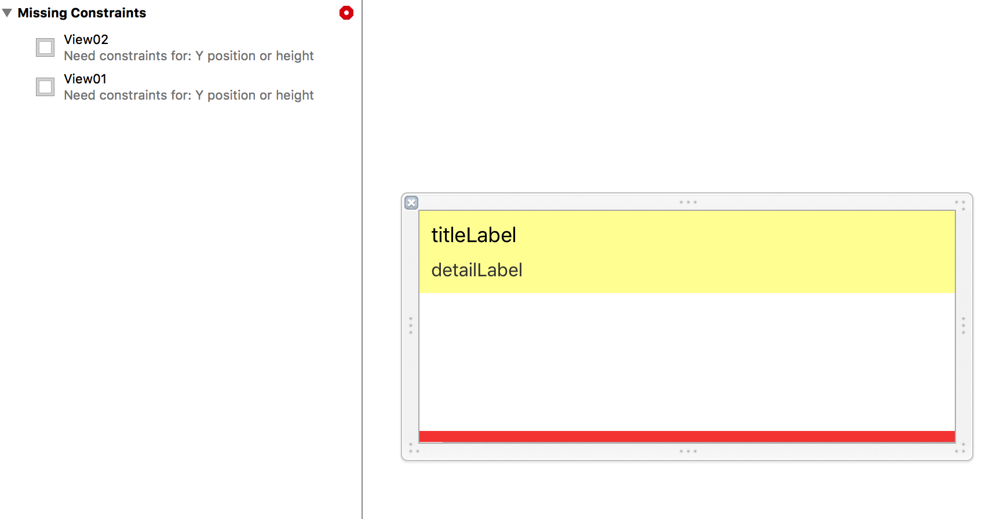
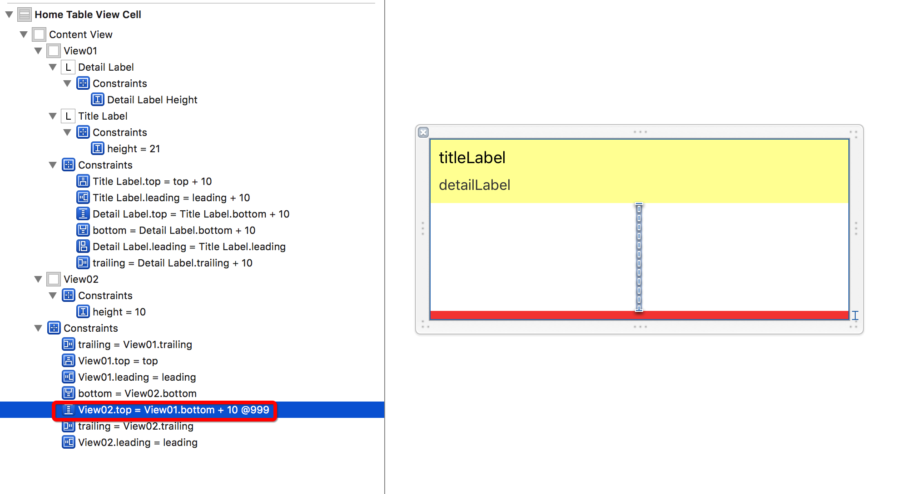

# AutoLayout

#### 约束优先级

参考资料：  
[iOS的一个小技巧——AutoLayout约束的优先级](http://www.jianshu.com/p/1410f4eab8b3)

约束的优先级数值范围为1～1000；  
添加的约束默认优先级为1000(最大)；  
UI控件的固有约束(intrinsic content size)，如我们不需要设置UILabel的宽高，它就可以根据要显示的内容进行自适应，这就是固有约束在起作用。   

Conetnt Hugging(拥抱) Priority 抗拉伸优先级  
当父视图的范围比较大于要显示的子视图时，会对子视图进行拉伸；此时优先级越大的，越晚被拉伸；即优先级越小的，越先被拉伸（改变）。

Content Compression(压缩) Resistance(抵抗) Priority  抗压缩优先级  
当子视图的内容超出父视图的范围时，会对子视图进行压缩；此时压缩优先级越大，越晚被压缩；即优先级越小的，越先被压缩（改变）。

开发中遇到的约束冲突问题：   
如下图所示，黄色视图view01上放了两个label，两label距离黄色视图的四边已经设置约束距离，两label的高度约束也设置过；红色视图view02设置高度约束；设置黄红两个视图的竖直间距为10.

这时候，由于竖直方向上的约束冲突，系统会直接报下面的警告(错误):  
  

解决办法，改变（改下）竖直方向上任意一个约束的优先级，比如修改view01与view02的竖直间距优先级(当然也可以更改其中一个label的高度 或 view02的高度 或 view02距离底部的距离 等)：  

#### AutoLayout动画

参考资料：  
[UIView中layoutSubviews、layoutIfNeeded、setNeedsLayout的使用](/Users/liushuo199/Documents/LearnNote/--kiushuo/UIView中layoutSubviews、layoutIfNeeded、setNeedsLayout的使用.md)

当添加完约束后，系统并不会立即进行视图的绘制，所以当我们使用U`IView.animation`添加约束的时候并不会看到动画效果。所以我们需要通知系统马上进行子视图布局，所以当添加完约束后，在`UIView.animation`的`block`块中执行`superView.layoutSubviews()`即可显示出动画效果。
