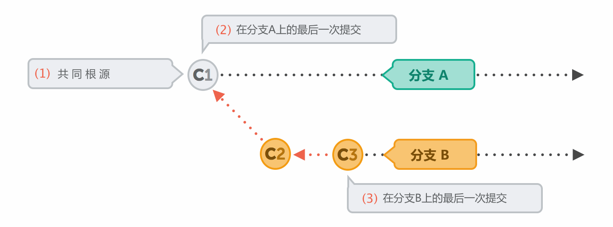
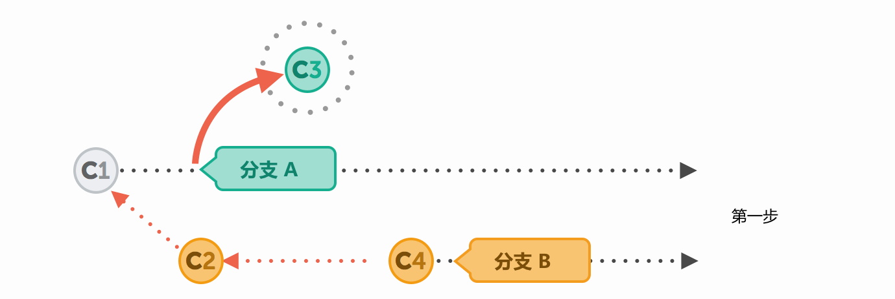

[参考资料](https://www.git-tower.com/learn/git/ebook/cn/command-line/advanced-topics/rebase#start)  

#### Rebase 代替合并
虽然合并（merge）操作可以用来简单和方便地整合改动，但是它却不是唯一的方法。“Rebase” 就是另一种替代手段。  

>
注释  
虽然 rebase 相对于我们已知的整合操作来说有着比较显著的优点，但是这也是在很大程度上取决于个人的喜好。一些团队喜欢使用 rebase，而另一些可能倾向于使用合并。


### 深入了解合并操作  
在你进入 rebase 这个主题前，我们有必要来再次探讨一下更多关于合并操作的细节。当 Git 执行一个合并时，它实际上会查找三个提交：

(1)共同的原始提交  
如果你在项目中查看两个分支的历史，它们总是会出自于一次共同的提交，那么在当时的时间点上，这两个分支还是拥有相同的内容。之后它们就开始有了差别。  
(2) + (3) 两个分支的最终点  
合并操作的目的就是把两个分支的最新状态结合起来。因此他们各自的最新版本是有特殊含义的。
结合这三个提交后得到的结果就是我们整合的目标。

### 快进或合并提交  
一种最简单的情况是，在其中的一个分支上没有任何一个新的改动提交发生。那么在它之前的最后一次提交就仍然还是那个共同的原始提交。


在这种情况下，执行整合操作就非常简单了。 Git 仅仅需要添加所有那些在另外一个分支上的新提交就可以了。在 Git 中，这种最简单的整合操作我们称之为 “快进（fast-forward）”合并。之后两个分支就拥有了完全相同的历史。


但是在大多数情况下，两个分支都会有自己不同的发展轨迹。


为了完成整合，Git 会需要创建一个新的提交来含括它们之间的差异，这就是整合提交（merge commit）。


### 手工提交与合并提交
通常情况下，提交都是由手工精心创建的。这样也就能更好地保证一次提交只涉及一个关联改动，并且能更好地注释这个提交。

一个合并提交就不同了，它不是由开发人员手动创建的，而是由 Git 自动生成的。它也不涉及一个关联改动，其目的只是连接两个分支，就像节点一样。如果之后想要了解某个合并操作，你只需要查看这两个分支的历史记录和它们相应的提交树（version tree）。

### Rebase 整合
有些人并不喜欢使用这种自动合并提交。相反，他们希望项目拥有一个单一的历史发展轨迹。比如一条直线。在历史纪录上没有迹象表明在某些时间它被分成过多个分支。


现在就让我们一步一步地了解一下 rebase 操作吧！仍然来使用前面的例子：我们想合并分支 B 到 分支 A 中，但是这次使用 rebase 操作。


使用下面这个非常的简单的命令：  
```$ git rebase branch-B```  
首先，Git 会 “撤销” 所有在分支 A 上的那些在与分支 B 的共同提交之后发生的提交。当然，Git 不会真的放弃这些提交，其实你可以把这些撤销的提交想像成 “被暂时地存储” 到另外的一个地方去了。


接下来它会整合那些在分支 B（这个我们想要整合的分支）上的还未整合的提交到分支 A 中。在这个时间点，这两个分支看起来会是一模一样的。


最后，那些在分支 A 的新的提交（也就是第一步中自动撤销掉的那些提交）会被重新应用到这个分支上，但是在不同的位置上，在那些从分支 B 被整合过来的提交之后，它们就被 re-based 了。
整个项目开发轨迹看起来就像发生在一条直线上。相对于一个合并提交，rebase 包括了所有的组合变化，最原始的提交结构会被保留下来。


### Rebase 存在的陷阱
当然，使用 rebase 操作不会是永远一帆风顺的。很有可能会搬起石头砸自己的脚，因此你不能忽视一个重要的事实：rebase 会改写历史记录。

你有可能已经注意到了，在被 rebase 操作之后的版本中，提交 “C3*” 存在一个新添加的星号。这是因为，尽管这个提交的内容和 “C3” 完全一样，但是它实际上是一个不同的提交。这样做的原因是，它现在有一个新的源提交 C4（在最初创建 C3 时的源提交是 C1）。

一个提交仅仅包括很少的属性，比如作者，日期，变动和谁是它的父提交。如果改变其中任何一个信息，就必须创建一个全新的提交。当然，新的提交也会拥有一个新的 hash ID 。

如果还仅仅只是操作那些尚未发布的提交，重写历史记录本身也没有什么很大的问题。但是如果你重写了已经发布到公共服务器上的提交历史，这样做就非常危险了。其他的开发人员可能这时已经在最原始的提交 C3 上开始工作，并使它成为了一些新提交中不可或缺的部分，而现在你却把 C3 的改动设置到了另一个时间点（就是那个新的 C3*）。除此之外，通过rebase 操作，这个原始的 C3 还被删除掉了，这将是非常可怕的……

因此你应该只使用 rebase 来清理你的本地工作，千万不要尝试着对那些已经被发布的提交进行这个操作。  

>
“一个提交仅仅包括很少的属性，比如作者，日期，变动和谁是它的父提交”。很显然，Rebase变基操作会改变父提交，从而导致提交历史的改变。反应在sourceTree上是提交时间的变化(但是在远端网页上的提交记录显示的时间却是正确的)，时间由之前的准确提交时刻变成了变基成功后的时间。当多个不同提交时，提交次数未发生改变(不会变成一个)，仅改变时间。

#### 变基操作的黄金法则  
***不要在公共分支上使用***
