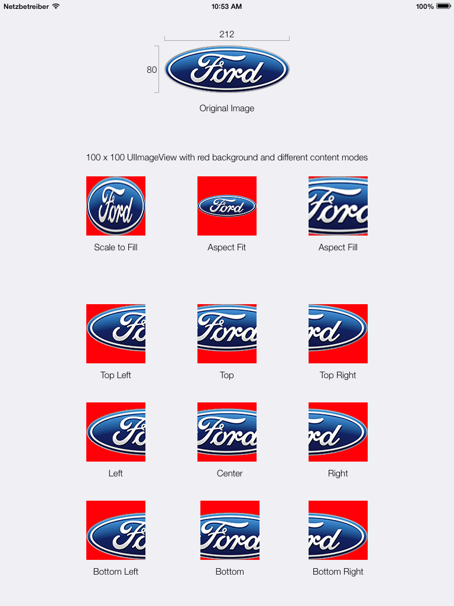

# UIView的contentModes

```
public enum UIViewContentMode : Int {
    
    case scaleToFill

    case scaleAspectFit // contents scaled to fit with fixed aspect. remainder is transparent

    case scaleAspectFill // contents scaled to fill with fixed aspect. some portion of content may be clipped.

    case redraw // redraw on bounds change (calls -setNeedsDisplay)

    case center // contents remain same size. positioned adjusted.

    case top

    case bottom

    case left

    case right

    case topLeft

    case topRight

    case bottomLeft

    case bottomRight
}
```

  
