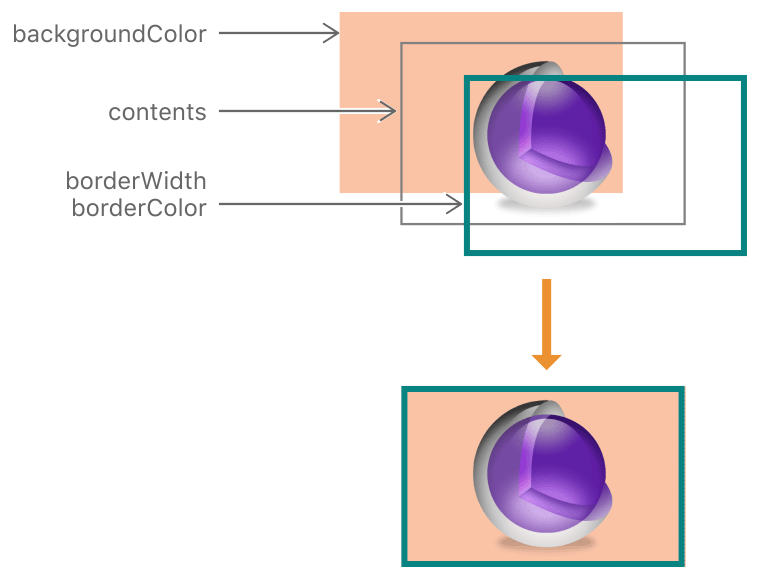
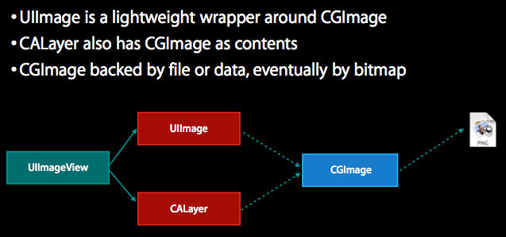

### UIKit性能优化

从UI角度考虑对项目进行性能优化。

参考资料：  
[UIKit性能调优实战讲解](http://www.jianshu.com/p/619cf14640f3)   
[iOS 高效添加圆角效果实战讲解](http://www.jianshu.com/p/f970872fdc22)  
[小心别让圆角成了你列表的帧数杀手](http://www.cocoachina.com/ios/20150803/12873.html)  
[离屏渲染优化详解：实例示范+性能测试](http://www.jianshu.com/p/ca51c9d3575b)  

* 所谓的性能具体指什么？  
  界面的流畅度 
* 影响性能的几个因素？   
  
* 如何解决或者避免UI对性能的影响？  
  

### fps帧率 -- 反应流畅度的数字指标

任何屏幕都有一个刷新率，比如iPhone推荐的刷新率为60Hz，也就是说GPU每秒钟刷新屏幕60次，故两次刷新之间的间隔为1/60 m = 16.67 ms。这段时间内屏幕保持不变，称之为一帧(frame)，fps表示frame per second，也就是每秒钟显示多少帧画面，对于静止不变的内容，我们不需要考虑他的刷新率，但是在执行滑动或动画时，fps的值直接反映出滑动的流畅度。   

### 图层混合  

屏幕上的每一个点都是像素，像素由R、G、B三种颜色构成，如果某一块区域上覆盖了多个layer，最后的显示效果受到layer的共同影响。这种颜色的混合需要消耗一定的GPU资源，所以==尽量不要或减少透明效果的使用，从而节约不必要的计算==。 经验证，图层混合对帧率的影响非常小。

### 光栅化

光栅化是将一个layer预先渲染成位图，然后加入到缓存中。缓存中的对象的有效期是0.1s，即如果在0.1s内没有使用就会自动从缓存中清除。  
`label.layer.shouldRasterize = true`  
光栅化是一把双刃剑，先写入缓存再读取可能会消耗较多的时间，因此光栅化仅适用于较复杂的、静态的效果。如果没有特殊需要尽量不要打开光栅化。  

### 离屏渲染

离屏渲染即发生在屏幕之外的渲染。离屏渲染意味着把渲染结果保存起来，等到用的时候再取出来，因此相对于普通渲染更耗费资源。  

什么情况下会出现离屏渲染？  

1. 重写`drawRect`方法；
2. 有mask或者阴影(`layer.masksToBounds, layer.shadow*`)，模糊效果也是一种离屏渲染；
3. 光栅化`layer.shouldRasterize = true`；

前两种是自动触发离屏渲染，后一种是手动开启离屏渲染。

### UIView与CALayer的关系

UIView是对CALayer的封装。  
CALayer用于显示内容contents；UIView为其提供内容，以及负责处理触摸等事件，参与响应链。



CALayer由背景颜色、内容、边框三部分构成。  
从CALayer 文档第一句话：「The CALayer class manages image-based content and allows you to perform animations on that content.」来看UIView 的显示内容很大程度上就是一张图片(CGImage)。  

### UIImageView  



* UIImage是对CGImage的轻量级分装
* CALayer也是用CGImage作为内容
* CGImage支持文件、数据以及位图


### rounded corners 圆角

文档中cornerRadius的Discussion:

```
Setting the radius to a value greater than 0.0 causes the layer to begin 
drawing rounded corners on its background. By default, the corner radius does 
not apply to the image in the layer’s contents property; it applies only to 
the background color and border of the layer. However, setting the 
masksToBounds property to true causes the content to be clipped to 
the rounded corners.

```
默认状态下cornerRadius适用于layer中的background color和border，不适用于layer的contens。当设置过masksToBounds = true后，content也可以被裁剪了。  


### 如何高效的设置视图圆角？  

测试前提： 在tableView中放置200个cell，每个cell上放置12个imageView，设置上图片，开始切圆角，并且设置`layer.masksToBounds = true`。  

是否出现离屏渲染的标准：使用Xcode自带的Instruments->Core Animation->Color Offscreen-Rendered Yellow，圆角出变黄则认为出现离屏渲染。 

测试过程中发现的现象：   

1. 圆角大小`imageView.layer.cornerRadius`对帧率几乎没有影响，因此可以认为其对性能没有影响。  
2. 单独设置`layer.cornerRadius > 0`或`layer.masksToBounds = true`都不会引起离屏渲染，只有当这两个同时存在时，才有可能出现离屏渲染。  
3. iOS10之后，即使满足前一个条件，也不会出现离屏渲染。  
 

* 测试代码0-1:

	```
	imageView.layer.cornerRadius = 10 
	imageView.layer.masksToBounds = true
	```

	|设备/系统   |帧率值      | 是否感觉到卡顿| 是否有离屏渲染 |
	|:---------:|:---------:|:---------:|:------:|  
	| iPhone5 iOS10.3.3 | 50 | 无 | 无 |
	| iPhone6s iOS10.3.3 | 57 | 无 | 无 |
	| iPhone6P iOS9.0.1 |  9  |  有  | 有 |

	结论：iOS10之前，开启`layer.masksToBounds = true`会触发离屏渲染，从而影响界面的帧率。iOS10之后系统进行了优化不会触发离屏渲染。
	
	###### ...接下来仅对iOS10之前的设备进行测试验证


* 测试代码0-2：  

	```
	imageView.layer.cornerRadius = 10
	imageView.layer.masksToBounds = true
	imageView.layer.shouldRasterize = true
	```
	|设备/系统   |帧率值      | 是否感觉到卡顿| 是否有离屏渲染 |
	|:---------:|:---------:|:---------:|:------:|  
	| iPhone6P iOS9.0.1 |  6  |  有  | 有 |

* 测试代码0-3:  
	
	
即然只有同时设置`layer.cornerRadius > 0`和`layer.masksToBounds = true`才会出现离屏渲染，那么到底


