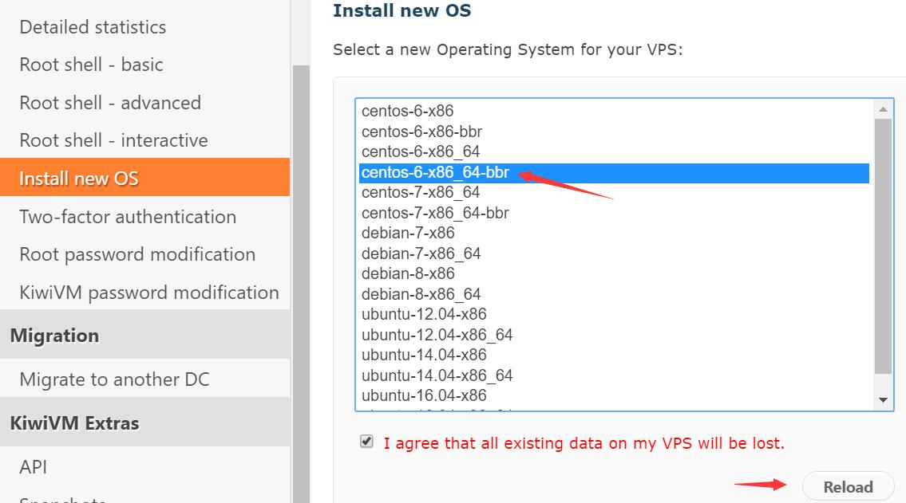

# 搬瓦工 ShadowsocksX

终端中设置代理：  
[参考资料](https://blog.fazero.me/2015/09/15/%E8%AE%A9%E7%BB%88%E7%AB%AF%E8%B5%B0%E4%BB%A3%E7%90%86%E7%9A%84%E5%87%A0%E7%A7%8D%E6%96%B9%E6%B3%95/)  
curl ip.cn //查看ip地址归属地  如果不起作用换用 curl cip.cc  
export ALL_PROXY=socks5://127.0.0.1:1080  
！！注意：ip地址和端口号不一定就是127.0.0.1和1080，可以在Shadowsocks的偏好设置里面查看  
  

[中文网-1](http://www.bandwagonhost.net/)  
[中文网-2](http://banwagong.cn/) 

## 搬瓦工详细教程
[原文连接](http://www.huizhanzhang.com/2017/05/bandwagon-one-key-shadowsocks.html)

1、购买vps.
在[中文教程](http://banwagong.cn/) 、[官网首页](https://bandwagonhost.com/)中选择合适的服务。  

2、选择完服务后点击进入详情界面，注释看好是年付还是月付服务，选择合适的地区，add to cart，加入到购物车。

3、购买时可以选择使用优惠码，优惠码具有时效性，可以在[中文教程](http://banwagong.cn/)首页中获取最新的优惠码。购买时在左下角的promotional code中输入即可。

点击check out结账。

4、填写好自己的资料，请如实填写，否则有可能被强制退款。地址填写，英语不会的可以用拼音。
选择alipay支付宝，勾选同意服务条款，点击complete order提交订单。

5、随后，点击paynow会跳转至支付宝页面，付款即可。

6、付款完成后，会跳转回搬瓦工，这时，你的后台就多了一个vps，并且会邮件通知你vps的ip、端口与密码。（这里用我之前购买过的一台vps进行演示）。
点击KiviVM Control Panel进入控制面板，我们进行安装shadowsocks的操作。

7、目前搬瓦工的一键Shadowsocks功能仅支持centos6系统，x64与x86均可。因此，我们首先在后台安装centos6系统。点击左侧的install new os，选择centos-6开头的任意系统。例如，这里选择了带bbr加速的centos6 x86 x64系统。勾选底部的 i agree。。。，点击reload。

**如果系统提示需要关机才能安装，那么我们点击左侧main control，点击右侧的stop后再操作即可。**  

8、几分钟后，系统已经安装好，页面会提示你的密码与ssh端口，注意保存。虽然我们一键安装shadowsocks是不需要这个的，但是日后如果需要远程连接你的vps做其他事情还是需要的。

9、这时查看控制面板首页，系统已经换成了centos6.

10、点击左侧的shadowsocks server，随后点击右侧install shadowsocks server.
系统就开始自动安装shadowsocks，几秒钟就安装完毕。

11、系统出现下图的时候，就已经安装完毕了。

12、我们刷新下页面，重新点击左侧的shadowsocks server菜单，页面已经变成了下图。这三项是你链接你的vpn的必要内容，并且搬瓦工贴心的在页面下方展示了教程。

13、在[Shadowsocks官网](https://shadowsocks.org/en/download/clients.html) 下载对应的shadowsocks，Mac版的下载地址会连接到githut [Mac版shadowsocks下载地址](https://github.com/shadowsocks/ShadowsocksX-NG/releases)，下载完成后在服务器-服务器设置中添加ip。地址就是第6条中对应的ip地址，端口号、加密方式和密码是第12步中的setver port、server encryption和server password。点击确定即可。

iPhone手机可以在AppStore中下载一个叫FirstWingy的App(因为原本的wingy收费)，然后安装类似上面步骤添加ip，即可。
